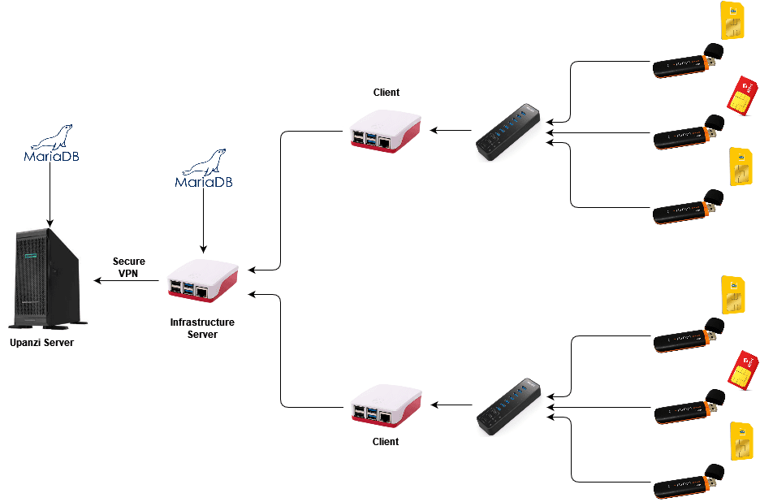

# HONEYNET INFRASTRUCTURE SET UP

## Architecture
The architecture diagram below illustrate how the honeynet data collection infrastructure is set up



## 0. Prerequisite
- Anyone with an intermediate understanding of Linux, NodeJS, and ReactJS can configure this infrastructure

- Make certain that the datetime (timestamp) on the Raspberry Pis, server, and personal machine are synchronized and set to the same timezone

- Gammu v1.41.0, Raspisms v3.5.4 and php v7.4.33. Note php versions above 7 are not compatible with the aforementioned Gammu and Raspisms versions

<!-- Requirements -->
## 1. Requirements

### 1.1 Hardware
- Raspberry PI (Preferably raspberry pi 4)

- GSM Modem (Should be compatible with Gammu utility - See https://wammu.eu/phones/ for a list of Gammu comptible phones/GSM modems). In our experiment we used HSDPA Wireless Data Card (3G/4G Mobile Broadband Wireless USB Dongle)

- SIM Cards from relevant MNOs

- Micro SD Card with the Raspbian OS installed (Current OS is recommended)

- Ethernet cable for connecting to a network switch (You can alternatively enable WiFi on the Raspberry Pi)

### 1.2 Software
- RaspiSMS 

- Gammu

- RPi Monitor


## 2. Establishing a Raspberry Pi as a dedicated mariadb server

### 2.1 Installing mariadb

- Install a 64-bit Raspberry PI OS using the Raspberry Pi Imager. Reference: https://www.raspberrypi.com/software/

- Perform update and upgrade of raspberry pi: `sudo apt update && sudo apt upgrade`

- Install the mariadb server: `sudo apt install mariadb-server`

- Configure and secure mariadb server: `sudo mariadb-secure-installation`
	- NOTE: Read the instructions carefully and execute the following
		- Switch to unix_socket authentication [Y/n] n

		- Change the root password? [Y/n] Y

		- Remove anonymous users? [Y/n] Y

		- Disallow root login remotely? [Y/n] Y

		- Remove test database and access to it? [Y/n] Y

		- Reload privilege tables now? [Y/n] Y

- Change the `bind-address` to `0.0.0.0`: `sudo nano /etc/mysql/mariadb.conf.d/50-server.cnf`

- Restart mariadb server: `systemctl restart mariadb`

- Execute `sudo lsof -i -P -n` and verify that mariadb is operational on port 3306

- Run `netstat -ant | grep 3306` to check the listening status. An output similar to `tcp        0      0 0.0.0.0:3306            0.0.0.0:*               LISTEN` must be seen

- Access the mariadb database: `mysql -u root -p`
	- Create database: `CREATE DATABASE <database_name>;`

	- Create a new user: `CREATE USER '<username>'@'%' IDENTIFIED BY '<password>';`

	- Grant privileges to new user: `GRANT ALL PRIVILEGES ON *.* TO '<new_username>'@'%' IDENTIFIED BY 'user_password' WITH GRANT OPTION;`

	- Create the necessary tables
		- ```
			CREATE TABLE user (
    			user_id     varchar(100) NOT NULL PRIMARY KEY,
    			email       varchar(100) NOT NULL,
    			password    varchar(100) NOT NULL,
    			institution varchar(100) NOT NULL,
    			joinDate    datetime     NOT NULL
			);
		  ```

		- ```
			CREATE TABLE last_online (
    			online_id        int(11)      NOT NULL PRIMARY KEY AUTO_INCREMENT,
    			pi_id            varchar(20)  DEFAULT NULL,
    			pi_ip            varchar(20)  DEFAULT NULL,
    			online_time      datetime     DEFAULT NULL,
    			num_of_modems    varchar(5)   DEFAULT NULL,
    			available_modems varchar(5)   DEFAULT NULL
			);
		  ```

		- ```
			CREATE TABLE received (
    			id         int(11)       NOT NULL PRIMARY KEY AUTO_INCREMENT,
    			at         datetime      DEFAULT NULL,
    			text       varchar(1000) DEFAULT NULL,
    			origin     varchar(50)   DEFAULT NULL,
    			command    int(11)       DEFAULT NULL,
    			status     varchar(20)   DEFAULT NULL,
    			id_user    int(11)       DEFAULT NULL,
    			id_phone   int(11)       DEFAULT NULL,
    			mms        int(11)       DEFAULT NULL,
    			created_at datetime      DEFAULT NULL,
    			updated_at datetime      DEFAULT NULL,
    			pi_id      varchar(50)   DEFAULT NULL
			);
		  ```

### 2.2 Installing docker
- Perform an update and upgrade of the system: `sudo apt update && sudo apt upgrade`

- Run the official Docker setup script: `curl -sSL https://get.docker.com | sh`

- Add our current user to the docker group: `sudo usermod -aG docker $USER`

- Logout to allow changes to take effect: `logout`

- Test if docker is running: `docker run hello-world`


<!-- Software Installation -->
## 3. Software Installation

### 3.1 Update & Upgrade Raspbian OS
- Ensure that the raspberry pi has stable internet connection before proceeding

- Run command: `sudo apt update && sudo apt upgrade -y`

- Should errors arise during upgrade, change the raspbian mirror by replacing the existing lines of code in the sources.list file with the ones below. `sudo nano /etc/apt/sources.list`
```
deb http://mirror.liquidtelecom.com/raspbian/raspbian/ bullseye main contrib non-free rpi
# Uncomment line below then 'apt-get update' to enable 'apt-get source'
#deb-src http://raspbian.raspberrypi.org/raspbian/ bullseye main contrib non-free rpi
```


<!-- RaspiSMS & Gammu -->
### 3.2 RaspiSMS & Gammu
- RaspiSMS will be used to view sms messages received by sim cards

- Gammu will be used to retrieve sms messages received by sim cards

- Add the apt.raspisms.fr repository. Run the commands belows
```
sudo apt install -y apt-transport-https gnupg2 curl
echo "deb https://apt.raspisms.fr/ buster contrib" | sudo tee -a /etc/apt/sources.list.d/raspisms.list
curl https://apt.raspisms.fr/conf/pub.gpg.key | sudo apt-key add -
sudo apt update -y
```

- Install the raspisms package: `sudo apt install raspisms`
	- Set up the local MySQL database with username `root` and a password of your choosing
		- The local database can be accessed by running the command `mysql -u root -p`

		- Upon successful authentication, run the command `use raspisms` to access the `raspisms database`. The raspisms database contains the `received` table where sms records received by sim cards are stored

	- Setting up smtp is optional

- Gammu installation: Installing raspisms automatically installs the `gammu package`

- Note: Should errors arise during raspisms installation, change the raspbian mirror by replacing the existing lines of code in the sources.list file with the ones below. `sudo nano /etc/apt/sources.list`
```
deb http://mirror.liquidtelecom.com/raspbian/raspbian/ bullseye main contrib non-free rpi
# Uncomment line below then 'apt-get update' to enable 'apt-get source'
#deb-src http://raspbian.raspberrypi.org/raspbian/ bullseye main contrib non-free rpi
```

- Reference: https://raspisms.fr/download/


<!-- RPi Monitor -->
### 3.3 RPi Monitor
RPi-Monitor will be used to monitor raspberry pi metrics
```
sudo apt update && sudo apt upgrade -y
sudo apt-key adv --recv-keys --keyserver keyserver.ubuntu.com 2C0D3C0F
sudo wget http://goo.gl/vewCLL -O /etc/apt/sources.list.d/rpimonitor.list
sudo apt update
sudo apt install rpimonitor
sudo systemctl status rpimonitor
```

- Accessing RPI-Monitor on Raspberry Pi: Paste `raspberry-pi_ip-address:8888` in a browser

- Reference: https://linuxhint.com/monitor-raspberry-pi-using-rpi-monitor/


<!-- Configuration Setup-->
### 4. Configuration Setup
- We would consider two separate setups: `a single raspberry pi hosting one USB modem at a time` and `a single raspberry pi hosting multiple USB modems at a time`

#### 4.1 Raspberry Pi Hosting One USB Modem
- Attach a USB modem to the raspberry pi

- Check if USB modem can be identified by raspberry pi: `lsusb`

- Upon execution of the command above, an output of the format below should be seen
```
Bus 001 Device 007: ID 05c6:1000 Qualcomm, Inc. Mass Storage Device
Bus 001 Device 004: ID 0424:7800 Microchip Technology, Inc. (formerly SMSC)
Bus 001 Device 003: ID 0424:2514 Microchip Technology, Inc. (formerly SMSC) USB 2.0 Hub
Bus 001 Device 002: ID 0424:2514 Microchip Technology, Inc. (formerly SMSC) USB 2.0 Hub
Bus 001 Device 001: ID 1d6b:0002 Linux Foundation 2.0 root hub
```

OR

```
Bus 001 Device 006: ID 05c6:6000 Qualcomm, Inc. Siemens SG75
Bus 001 Device 004: ID 0424:7800 Microchip Technology, Inc. (formerly SMSC)
Bus 001 Device 003: ID 0424:2514 Microchip Technology, Inc. (formerly SMSC) USB 2.0 Hub
Bus 001 Device 002: ID 0424:2514 Microchip Technology, Inc. (formerly SMSC) USB 2.0 Hub
Bus 001 Device 001: ID 1d6b:0002 Linux Foundation 2.0 root hub
```

- When the modem is detected in the Mass Storage Device format, like `Bus 001 Device 007: ID 05c6:1000 Qualcomm, Inc. Mass Storage Device`, it needs to be switched to the GSM state, enabling it to receive SMS messages, similar to `Bus 001 Device 006: ID 05c6:6000 Qualcomm, Inc. Siemens SG75`. Run the command `sudo usb_modeswitch -W -v 05c6 -p 1000 -K` to switch the USB modem to the GSM state. Run the `lsusb` command to verify the USB modem state

- To proceed, generate a configuration file in `.rc` format for the USB modem. Ensure that the configuration file's name follows the convention of starting with the word `gammu`, for example, `gammu_conf.rc`. Run the command `sudo gammu-detect` to automatically detect the modem's configuration. The output of the command becomes the content of the configuration file. The file must be stored in the `/etc` directory. Run the command `sudo nano /etc/name_of_configuration_file.rc` to create the configuration file

- The configuration file should have an output similar to the one below
```
; Configuration file generated by gammu-detect.
; Please check The Gammu Manual for more information.

[gammu]
device = /dev/ttyUSB0
name = Phone on USB serial port Qualcomm__Incorporated Qualcomm_CDMA_Technologies_MSM
connection = at

[gammu1]
device = /dev/ttyUSB1
name = Phone on USB serial port Qualcomm__Incorporated Qualcomm_CDMA_Technologies_MSM
connection = at

[gammu2]
device = /dev/ttyUSB2
name = Phone on USB serial port Qualcomm__Incorporated Qualcomm_CDMA_Technologies_MSM
connection = at

[gammu3]
device = /dev/ttyUSB3
name = Phone on USB serial port Qualcomm__Incorporated Qualcomm_CDMA_Technologies_MSM
connection = at
```

- Assign permission to the configuration file created: `sudo chmod 777 configuration_file`

#### 4.2 Raspberry Pi Hosting Multiple USB Modems
- Connect the GSM modems to a usb hub (multiplier) connected to the raspberry pi

- Identify the list of connected USB devices by running the command `lsusb`. You should have an output similar to the one below

```
Bus 001 Device 004: ID 046d:c534 Logitech, Inc. Unifying Receiver
Bus 001 Device 013: ID 05c6:6000 Qualcomm, Inc. Siemens SG75
Bus 001 Device 012: ID 05c6:6000 Qualcomm, Inc. Siemens SG75
Bus 001 Device 014: ID 05c6:6000 Qualcomm, Inc. Siemens SG75
Bus 001 Device 011: ID 05c6:6000 Qualcomm, Inc. Siemens SG75
Bus 001 Device 005: ID 214b:7250 Huasheng Electronics USB2.0 HUB
Bus 001 Device 006: ID 0424:7800 Microchip Technology, Inc. (formerly SMSC)
Bus 001 Device 003: ID 0424:2514 Microchip Technology, Inc. (formerly SMSC) USB 2.0 Hub
Bus 001 Device 002: ID 0424:2514 Microchip Technology, Inc. (formerly SMSC) USB 2.0 Hub
Bus 001 Device 001: ID 1d6b:0002 Linux Foundation 2.0 root hub
```

- Get port detail for each USB modem by running the command `dmesg | grep tty`. You should have an output similar to the one below. 

```
[    0.000000] Kernel command line: coherent_pool=1M 8250.nr_uarts=0 snd_bcm2835.enable_headphones=0
snd_bcm2835.enable_headphones=1 snd_bcm2835.enable_hdmi=1 snd_bcm2835.enable_hdmi=0 
video=HDMI-A-1:1920x1080M@60 vc_mem.mem_base=0x3ec00000 vc_mem.mem_size=0x40000000  console=ttyS0,115200 
console=tty1 root=PARTUUID=034aa078-02 rootfstype=ext4 fsck.repair=yes rootwait quiet splash plymouth.
ignore-serial-consoles
[    0.000492] printk: console [tty1] enabled
[    3.158431] 3f201000.serial: ttyAMA0 at MMIO 0x3f201000 (irq = 114, base_baud = 0) is a PL011 rev2
[    5.974868] systemd[1]: Created slice system-getty.slice.
[   42.424190] usb 1-1.1.3.1: GSM modem (1-port) converter now attached to ttyUSB0
[   42.425202] usb 1-1.1.3.1: GSM modem (1-port) converter now attached to ttyUSB1
[   42.425758] usb 1-1.1.3.1: GSM modem (1-port) converter now attached to ttyUSB2
[   42.426259] usb 1-1.1.3.1: GSM modem (1-port) converter now attached to ttyUSB3
[   42.803979] usb 1-1.1.3.3: GSM modem (1-port) converter now attached to ttyUSB4
[   42.804496] usb 1-1.1.3.3: GSM modem (1-port) converter now attached to ttyUSB5
[   42.804953] usb 1-1.1.3.3: GSM modem (1-port) converter now attached to ttyUSB6
[   42.805398] usb 1-1.1.3.3: GSM modem (1-port) converter now attached to ttyUSB7
[   43.234306] usb 1-1.1.3.4: GSM modem (1-port) converter now attached to ttyUSB8
[   43.235124] usb 1-1.1.3.4: GSM modem (1-port) converter now attached to ttyUSB9
[   43.235746] usb 1-1.1.3.4: GSM modem (1-port) converter now attached to ttyUSB10
[   43.236453] usb 1-1.1.3.4: GSM modem (1-port) converter now attached to ttyUSB11
[   43.664022] usb 1-1.1.3.2: GSM modem (1-port) converter now attached to ttyUSB12
[   43.665156] usb 1-1.1.3.2: GSM modem (1-port) converter now attached to ttyUSB13
[   43.665712] usb 1-1.1.3.2: GSM modem (1-port) converter now attached to ttyUSB14
[   43.666178] usb 1-1.1.3.2: GSM modem (1-port) converter now attached to ttyUSB15
```
Note that the output above may differ from the one you may obtain after running the above command in terms of usb address arrangement. Also, each modem has four USB devices (ttyUSB). For example, modem one(1) has devices (ttyUSB0 to ttyUSB3) and so on.

From the details above, it can be seen that the devices `ttyUSB0 to ttyUSB3` are connected to address `usb 1-1.1.3.1`, `ttyUSB12 to ttyUSB15` are connected to address `usb 1-1.1.3.2`, `ttyUSB4 to ttyUSB7` are connected to address `usb 1-1.1.3.3` and `ttyUSB8 to ttyUSB11` are connected to address `usb 1-1.1.3.4`.  However the devices to consider when creating the configuration files are `ttyUSB0, ttyUSB4, ttyUSB8 and ttyUSB12` since they appear first for each usb address.

<!-- Configuration Files -->
- Create configuration files for each USB modem in the `etc` directory.

<!-- First configuration files -->
- In creating the first configuration file for devices `ttyUSB0 - ttyUSB3` attached to port 1, run the command `sudo nano gammu_conf_1.rc`. The file should have the content below.
 
```
; Configuration file generated by gammu-detect.
; Please check The Gammu Manual for more information.

[gammu]
device = /dev/ttyUSB0
name = Phone on USB serial port Qualcomm__Incorporated Qualcomm_CDMA_Technologies_MSM
connection = at
```

<!-- Second configuration files -->
- In creating the second configuration file for devices `ttyUSB12 - ttyUSB15` attached to port 2, run the command `sudo nano gammu_conf_2.rc`. The file should have the content below.
 
```
; Configuration file generated by gammu-detect.
; Please check The Gammu Manual for more information.

[gammu]
device = /dev/ttyUSB12
name = Phone on USB serial port Qualcomm__Incorporated Qualcomm_CDMA_Technologies_MSM
connection = at
```

<!-- Third configuration files -->
- In creating the third configuration file for devices `ttyUSB4 - ttyUSB7` attached to port 3, run the comand `sudo nano gammu_conf_3.rc`. The file should have the content below.
 
```
; Configuration file generated by gammu-detect.
; Please check The Gammu Manual for more information.

[gammu]
device = /dev/ttyUSB4
name = Phone on USB serial port Qualcomm__Incorporated Qualcomm_CDMA_Technologies_MSM
connection = at
```

<!-- Fourth configuration files -->
- In creating the fourth configuration file for devices `ttyUSB8 - ttyUSB11` attached to port 4, run the comand `sudo nano gammu_conf_4.rc`. The file should have the content below.
 
```
; Configuration file generated by gammu-detect.
; Please check The Gammu Manual for more information.

[gammu]
device = /dev/ttyUSB8
name = Phone on USB serial port Qualcomm__Incorporated Qualcomm_CDMA_Technologies_MSM
connection = at
```

Note that [gammu] should always point to the first device attached to a specific usb address (in our case ttyUSB0, ttyUSB12, ttyUSB4 and ttyUSB8) when creating the configuration files.
 
- Assign permission to configuration files: `sudo chmod 777 gammu_conf_1.rc gammu_conf_2.rc gammu_conf_3.rc gammu_conf_4.rc`

- Reference: https://documentation.raspisms.fr/users/adapters/gammu.html


<!-- RaspiSMS Set Up -->
### 5. RaspiSMS Set Up

- To log in to RaspiSMS, you can access it by opening a web browser on the Raspberry Pi and typing either `http://127.0.0.1/raspisms` or `http://localhost/raspisms` in the address bar. Alternatively, if you are using a different device, such as a computer or smartphone, you can access RaspiSMS by entering the Raspberry Pi's IP address followed by `/raspisms` in the browser's address bar. 

- Find raspiSMS credentials by running the command `sudo cat /usr/share/raspisms/.credentials`

- On the raspiSMS interface, navigate to the `Telephones` tab and click on the `Add Phone` button.
	- Enter a phone name of your choosing

	- Under `Phone Type`, select `Gammu`

	- Under `config file`, enter the path to the configuration file that Gammu should use to connect to the phone. In our case this is `/etc/gammu_conf.rc`

	- Under `Pin code`, enter the Pin code of the SIM card used by the USB modem. From experience, we recommed disabling the use of Pin code for such experiments since it might interfere with SMS reception. In such case you can leave it blank

	- Repeat process for multiple modems

- Restart the raspisms service by running the command `sudo service raspisms restart`

- After following the above steps, you should be able to send/receive SMSs on the SIM card used by the USB dongle and view them on the RaspiSMS web interface. Should issues arise refer to `Section 8 (Possible Challenges)`


<!-- Transfering SMS Messages To Dedicated Raspberry Pi serving as a Server -->
### 6. Transfering SMS Messages To Central Database
- Access the honeynet infrastructure github repository in the browser of the Raspberry Pi

- Navigate to the `cronscripts` directory and download all the files to the `Downloads` folder on the Raspberry Pi

- Navigate to the `online_status_scripts` and download all the files to the `Downloads` folder on the Raspberry Pi

- Create a folder named `cronscripts` in the home directory: `cd ~` & `sudo mkdir cronscripts`. This folder will hold supporting files needed to move data to the dedicated raspberry pi serving as a server.

- Copy the following files to the cronscripts directory: `cd cronscripts` and run the following commands: `sudo cp /home/pi/Downloads/dbScript.php .` & `sudo cp /home/pi/Downloads/cron.log .` & `sudo cp /home/pi/Downloads/delete_sms.sh .`

- Edit the `dbScript.php` file by providing the necessary credentials to enable remote access

- Execute the command `crontab -e` and choose the `/bin/nano` option. Paste the code `0       0      *       *       *       php /home/pi/cronscripts/dbScript.php >> /home/pi/cronscripts/cron.log` in the file and save. This will ensure that the dbScript.php is run at specific time of the day. (In our case, the cron job runs at 00:00hrs daily)

- When testing the script, the user should execute commands as a root user.


<!-- Monitoring Dashboard -->
### 7. Monitoring Dashboard

#### 7.1 Service for monitoring gsm modem status on raspberry pi
The realtime service will be used to monitor the status of GSM modems. A USB modem is designated `online` if it's in a state capable of receiving SMS messages and vice versa

- Create a folder named `online_status_scripts` in the home directory: `cd ~` & `sudo mkdir online_status_scripts`. This folder will hold supporting files responsible for reporting the status of each USB modem connected to a raspberry pi
	
- Execute the following command to copy the following files to their respective directories: `cd online_status_scripts` and run the following commands: `sudo cp /home/pi/Downloads/time.sh .` & `sudo cp /home/pi/Downloads/insert.sql .` & `sudo cp /home/pi/Downloads/realtime.service /etc/systemd/system`

- Edit the `insert.sql` file by providing the `<database table name>` and the `<id>` of the raspberry pi being worked on

- Edit the `time.sh` file by replacing the `host_ip` and `host_name` with the appropriate values

- Start the realtime service: `sudo service realtime start`

#### 7.2 Hosting dashboard on dedicated raspberry pi server
- Download source code `(honeynet_dashboard)` from the Github repository on your personal computer

- Perform a git bash in the directory containing the downloaded source code

- Perform a secure copy of the source code `(honeynet_dashboard)` to the home directory of the dedicated raspberry pi serving as a server: `scp -r ./honeynet_dashboard <remote_user>@<remote_ip>:/home/<remote_user>`

- Access the remote machine (dedicated raspberry pi server) either via ssh or direct access, navigate to the `<remote user>` directory and subsequently to the directory of the source code (honeynet_dashboard)

- Follow the instructions in the `README.md` files present in the `client` and `server` directories to run the backend and frontend code via docker


<!-- Possible Challenges -->
### 8. Possible Challenges

#### 8.1 GSM mode not active
- Run the command `sudo usb_modeswitch -W -v 05c6 -p 1000 -K` to activate it. NB. Run multiple times until state is activated. Check status by running the command `lsusb`

#### 8.2 GSM mode activated but sim card not receiving SMS messages
- Check if modem contains sim card

- Check if sim card sms limit is at its maximum. if true, delete SMS messages
```
sudo gammu -c /etc/<configuration_file> monitor
sudo gammu -c /etc/<configuration_file> deleteallsms 1 or sudo gammu -c /etc/<configuration_file> deleteallsms 3
```
Note. `1` and `3` represent inbox folder of sim card and phone respectively.

- Check status of `raspisms.service`. If inactive, start service
```
sudo service raspisms status
sudo service raspisms start
```

Subsequently a restart can be done if the service is active
```
sudo service raspisms restart
sudo service raspisms status
```

- Run the command `dmesg | grep tty` to check which devices are connected to which ports. Make necessary changes to the corresponding configuration file by ensuring that `[gammu]` points to the right `ttyUSB` device

- Check the `Telephone` section on the Raspisms interface and ensure that a phone using the right configuration file has been created.

- Should the issue persist, perform a reboot of the raspberry pi.

#### 8.3 GSM Modem not reporting online status
- Check status of `realtime.service`. If inactive, start service
```
sudo service realtime status
sudo service realtime start
```

Subsequently a restart can be done if the service is active
```
sudo service raspisms restart
sudo service raspisms status
```

#### 8.4 "Error opening device. Unknown, busy or no permissions" repeated error
- Check if any other service is using the modem by running the command `lsof /dev/<device name>`. For example `lsof /dev/ttyUSB0`, etc.

- The above command will produce an output like the one below.
`
lsof: WARNING: can't stat() fuse.gvfsd-fuse file system /run/user/1000/gvfs
      Output information may be incomplete.
COMMAND    PID USER   FD   TYPE DEVICE SIZE/OFF NODE NAME
ModemMana  385 root   10u   CHR  188,0      0t0  499 /dev/ttyUSB0
python3   1490 root    9uW  CHR  188,0      0t0  499 /dev/ttyUSB0
`

- Stop and disable the ModemManager by running the commands. Note, the service `python3` is responsible for reading messages received by sim cards
```
sudo systemctl stop ModemManager
sudo systemctl disable ModemManager
```

- Reboot the raspberry pi.
